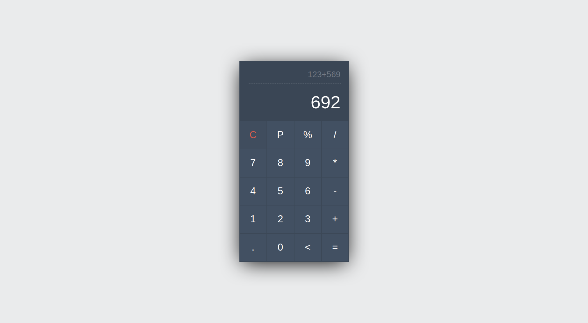

1. Implement required functions to show clicked digits in the Calculator's screen. For instance, when the end-user click on "1" (
1
), the clicked digit must be appreared here 
2536 + 419 + 

2. Implement at least 4 main mathematical functions (e.g., +,-,\*,/) as well as POW (power)
3. Reimplement at least one of the functions in a recursive format.
